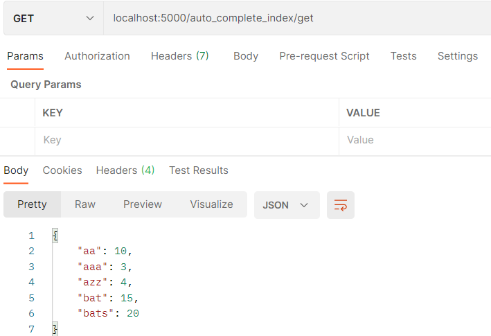

# autocomplete

<h1>autocomplete</h1>
The basic autocomplete can be run by calling "python task.py".

To run other programs, make sure all requirements are installed. Can easily do so by calling
"pip install -r requirements.txt"

<h2>basic use</h2>
Basic program can be run by calling "python task.py".

<h1>test rest api</h1>
<h2>Step 1. Start server using flask </h2>
Make sure flask is installed. Before starting server, must activate virtual environment. To do so, run "venv\Scripts\activate". Then, simply call "python api.py"
  

<h3>Option 1: test using test_api.py</h3>
With server running, navigate to tests folder, and then simply run "python test_api.py":

<h3>Option 1: manually test via Postman</h3>
With server running, open up Postman. The flask app runs on local host "localhost:5000" by default. 
All api methods can be found in "api.py" file in main directory. The route string is what we must enter in our request url, after "localhost:5000". 

For example, to get a list of all prefixes and their predictions in sorted order, we call GET with url "localhost:5000/auto_complete_index/get":

To add new options to our dictionary, we call POST on "localhost:5000/auto_complete_index/post", and supply the new words as json in our request body. 
The format must be {"options": [{"word": ___, "count": ___}, ..{"word": ___, "count": ___}]}

Notice how if we get our prefix-prediction map, we see the new entries:

To determine what our current prefix (what will be updated when called type_character() or delete_character()), we call GET "localhost:5000/auto_complete_search/get":

To append a letter to our prefix and return the predictions, we call PUT "localhost:5000/auto_complete_search/put/{char}", where char is the character we want to append:

To remove a letter from our prefix and return the predictions, we call DELETE "localhost:5000/auto_complete_search/delete":

<h1>Test solution</h1>
We can check that our model works by running it against a brute force class; the brute force class also gets predictions for a given prefix, but it does so by finding all words from a list of options that have the given prefix, then sorting them by value, and then returning the top k.

Inside the tests/ folder is the file "Aword.csv". This file contains all the words starting with the letter "a", with random numbers representing their value next to them. 
Running "python test_solution.py" verifies that our model returns the same results as for our brute force class, using the first 500 words from the "Aword.csv" file, and generatting a list of partly random strings and partly existing words to use as input. 

To run this test, simply call "python test_solution.py". 

